# Northwind SQL Business Analysis
Customer, Revenue & Operational Insights

## Overview
This project analyses the Northwind dataset using SQL to answer real-world business questions across customer behaviour, revenue, and operations.

It focuses on turning raw data into actionable insights by applying core SQL techniques like aggregation, grouping, and filtering. The analysis highlights key areas such as global customer distribution, high-value customers, business performance, and operational gaps.

## Project Objectives
1. Analyse customer distribution and diversity.
2. Evaluate business activity and revenue performance.
3. Identify high-value customers and strong markets.
4. Assess data quality issues.
5. Highlight operational gaps (e.g., unshipped orders).
6. Support decision-making for marketing, sales, and operations teams.

   
## Executive Summary
This project analyses the Northwind retail database to extract actionable business insights across customers, revenue, products, and operations using SQL.

Key findings show that:

* The business has a highly global customer base (91 countries).
* A small group of repeat customers drives significant activity.
* Revenue exceeds $1.26M, indicating strong commercial performance.
* There are data quality gaps (missing regions) and operational inefficiencies (pending shipments) that require attention.
* Core markets are concentrated in a few countries (USA, Germany, and France).

The analysis demonstrates how SQL can be used to translate raw data into business decisions.


## Dataset
#### Source: Northwind Database (SQLite)
#### Tables Used:
1. Customers
2. Orders
3. Order Details
4. Products
5. Suppliers
6. Categories

## Tools & Technologies
1. SQL (SQLite) – Data extraction & transformation
2. SQLite Online – Query execution
3. Excel – Data visualisation & reporting

## Project Workflow
1. Loaded dataset into SQLite
2. Wrote SQL queries based on business questions
3. Extracted and validated results
4. Exported results into Excel
5. Created charts and summaries
6. Interpreted insights for business stakeholders

## Business Questions & Analysis

### 1. Customer Diversity Analysis

Objective: Understand global customer distribution

```sql
SELECT DISTINCT country AS customer_country 
FROM Customers;
```

Visualisation: 

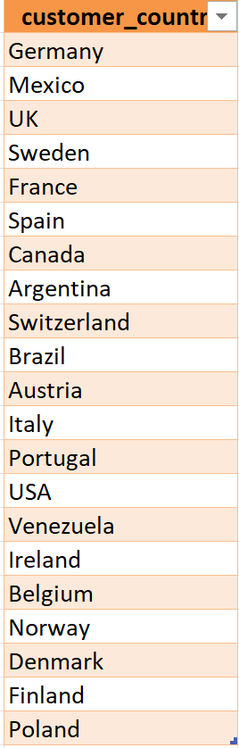

Insight:

* Customers span 91 countries, indicating a highly globalised customer base.
* This supports international marketing and expansion strategies.


### 2. Missing Data Audit

Objective: Identify incomplete customer records

```sql
SELECT CustomerID, CompanyName, Country 
FROM Customers 
WHERE Region IS NULL;
```

Visualisation:

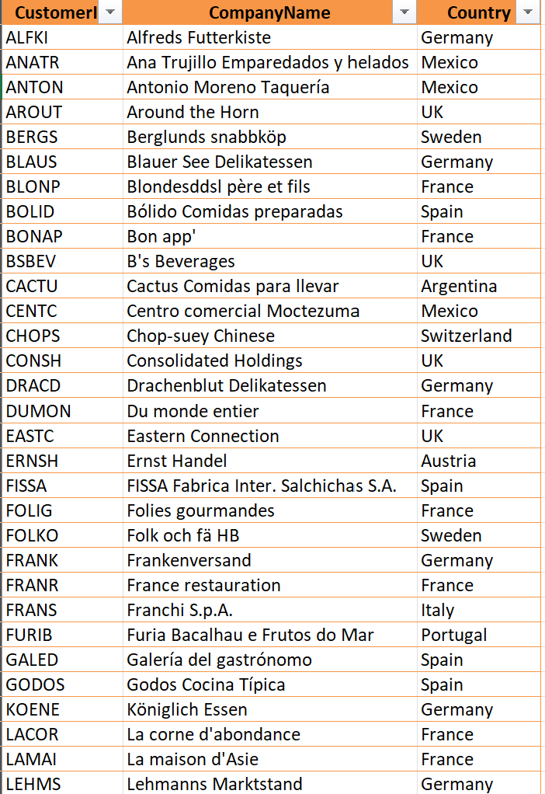

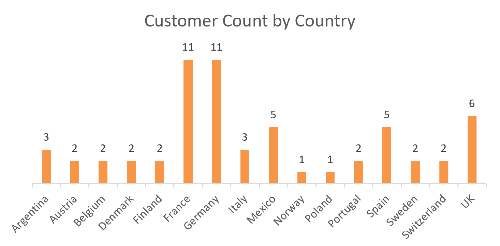

Insight:

* 60 customers (7.23%) have missing region data.
* This may impact logistics planning and regional marketing campaigns.


### 3. Order Volume Overview

Objective: Measure overall business activity

```sql
SELECT COUNT(DISTINCT CustomerID) AS total_customers,
COUNT(OrderID) AS total_orders
FROM Orders;
```

Visualisation:

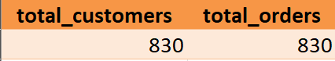

Insight:

* 830 total orders placed.
* Active customer base contributing to consistent transaction volume.


### 4. Revenue Calculation

Objective: Estimate total revenue

```sql
SELECT SUM(UnitPrice * Quantity * (1 - Discount)) 
AS total_revenue 
FROM "Order Details";
```

Visualisation:

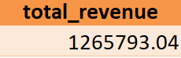

Insight:

* Total revenue = $1,265,793.04.
* Indicates a strong overall sales performance.


### 5. Product Performance by Category

Objective: Evaluate product distribution

```sql
SELECT CategoryID, COUNT(ProductID) AS product_count 
FROM Products 
GROUP BY CategoryID 
ORDER BY CategoryID ASC;
```

Visualisation:

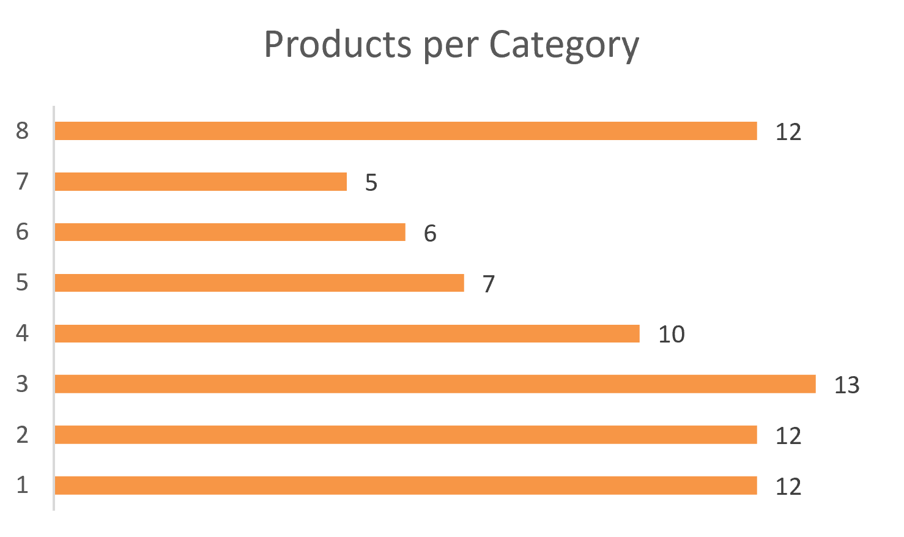

Insight:

* Category 3 (Confections) has the highest variety (13 products).
* Category 7 (Produce) has the lowest (5 products).
* This suggests uneven product distribution across categories.


### 6. High-Value Customers

Objective: Identify top-performing customers

```sql
SELECT CustomerID, COUNT(*) AS total_orders
FROM Orders  
GROUP BY CustomerID
HAVING total_orders > 10
ORDER BY total_orders DESC;
```

```sql
SELECT COUNT(*) AS high_order_customer_count
FROM (
    SELECT CustomerID
    FROM Orders
    GROUP BY CustomerID
    HAVING COUNT(OrderID) > 10
) AS eligible_customers;
```

Visualisation:


Insight:

* 28 high-value customers identified.
* Top contributors include:
    1. SAVEA (31 orders)
    2. ERNSH (30 orders)
    3. QUICK (28 orders)
* Revenue is concentrated among repeat customers.


### 7. Average Order Value (Freight)

Objective: Understand customer cost behaviour

```sql
SELECT CustomerID, AVG(Freight) AS avg_freight_cost
FROM Orders
GROUP BY CustomerID
ORDER BY avg_freight_cost ASC;
```

Visualisation:

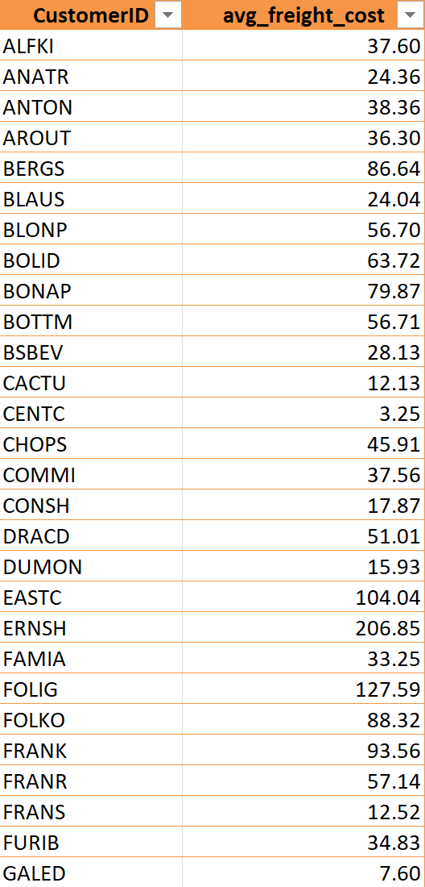

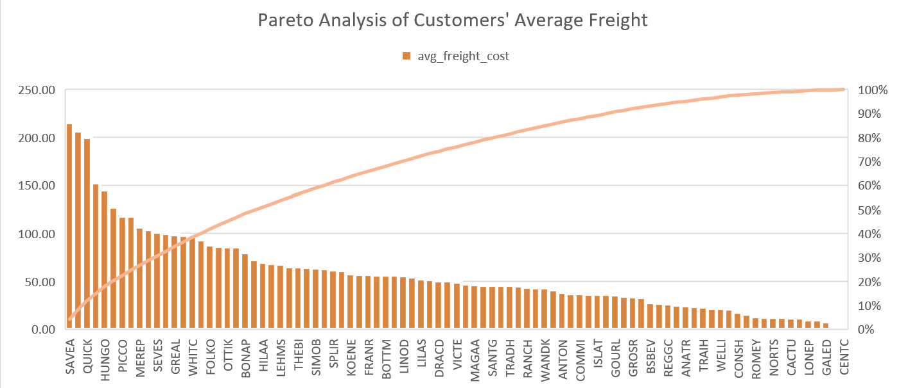

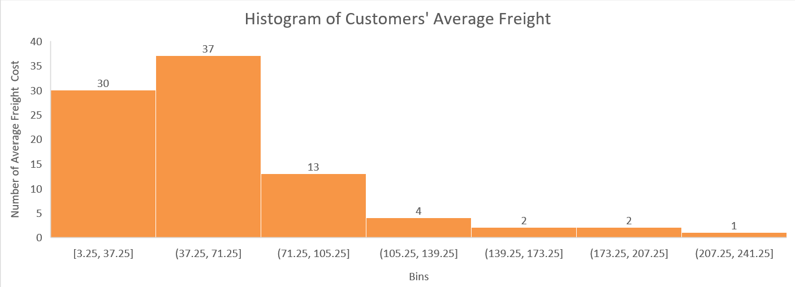

Insight:

* Freight costs range from 3.25 to 215.60.
* This indicates significant variation in shipping behaviour and possible differences in order size, distance, or priority shipping.


### 8. Supplier Analysis

Objective: Identify key suppliers

```sql
SELECT S.SupplierID, COUNT(P.ProductID) AS supply_count
FROM Suppliers S
LEFT JOIN Products P
ON S.SupplierID = P.SupplierID
GROUP BY S.SupplierID
HAVING supply_count > 5;
```

Visualisation:


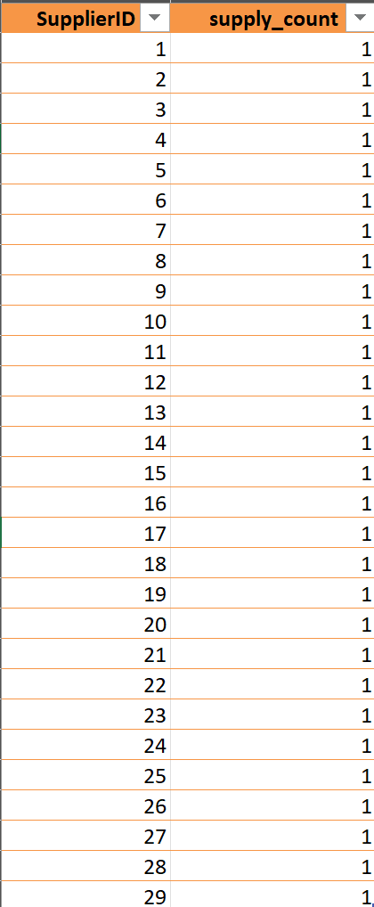

Insight:

* No supplier provides more than 1 product.
* Indicates a supplier diversification strategy in play.


### 9. Strong Market Identification

Objective: Identify high-customer regions

```sql
SELECT Country AS customer_country, COUNT(CustomerID) AS customer_count
FROM Customers
GROUP BY Country
HAVING customer_count > 5
ORDER BY customer_count DESC;
```

Visualisation:

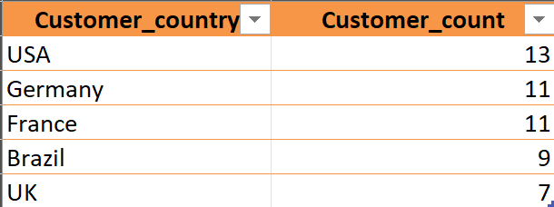

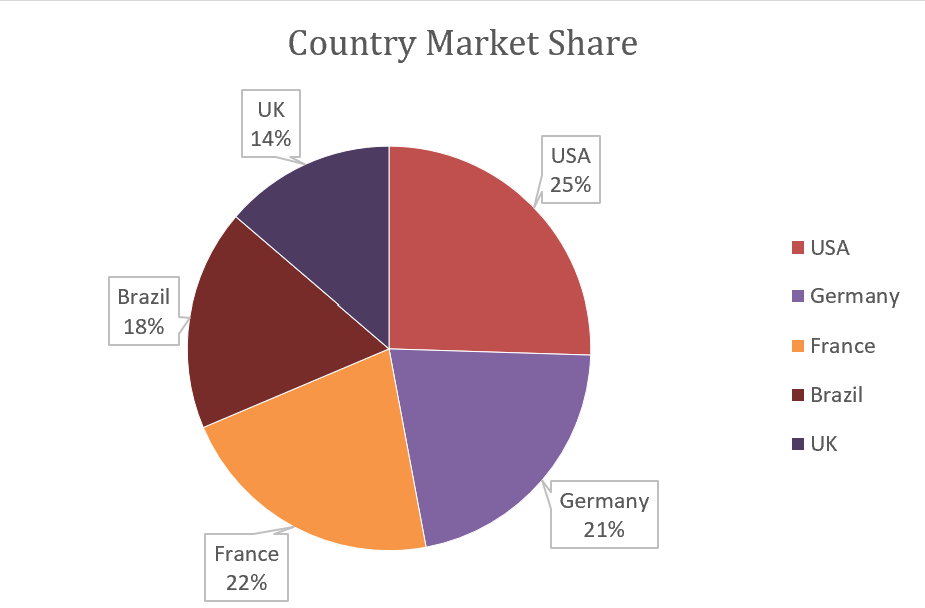

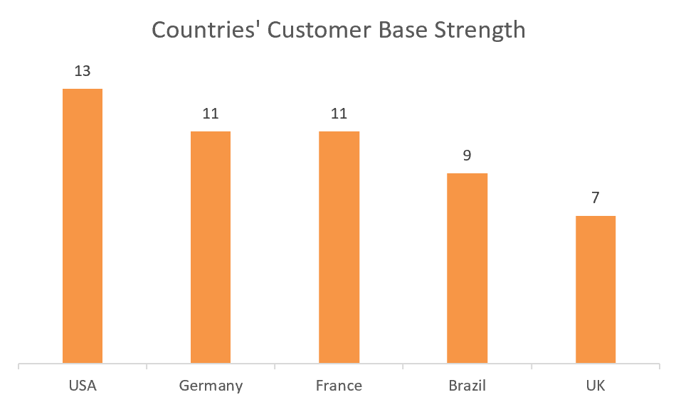

Insight:
* Top markets: USA (13), Germany (11), France (11), Brazil (9), and UK (7).
* These are priority regions for expansion and retention strategies.


### 10. Orders Without Shipment

Objective: Track operational delays

```sql
SELECT COUNT(OrderID) AS pending_shipments
FROM Orders
WHERE ShippedDate IS NULL;
```

Visualisation:


Insight:

* 21 orders are pending shipment.
* This indicates potential fulfilment delays and operational inefficiencies.


## Key Insights
1. Business operates globally across 91 countries.
2. Revenue exceeds $1.26M.
3. Repeat customers drive significant value.
4. 7.23% data incompleteness (regions missing).
5. Core markets are concentrated in 5 countries.
6. Operational gaps exist with pending shipments.
7. Supplier base is fragmented, not centralised.

## Recommendations
1. Improve data quality processes (mandatory region field).
2. Focus retention strategies on high-value customers.
3. Expand aggressively in top-performing countries.
4. Optimise logistics to reduce unshipped orders.
5. Evaluate supplier strategy for efficiency and scalability.

## Conclusion
Overall, the project demonstrates how data can support decision-making, identify growth opportunities, and improve business efficiency.

